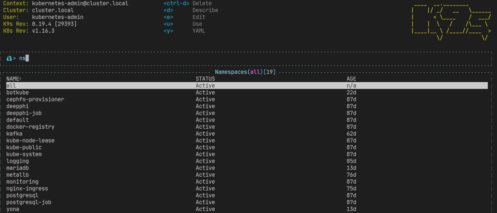
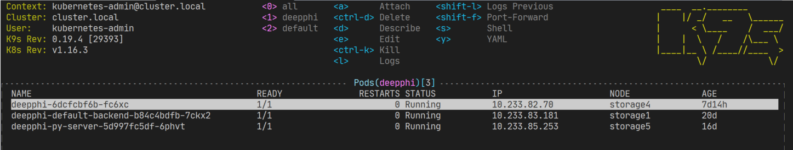
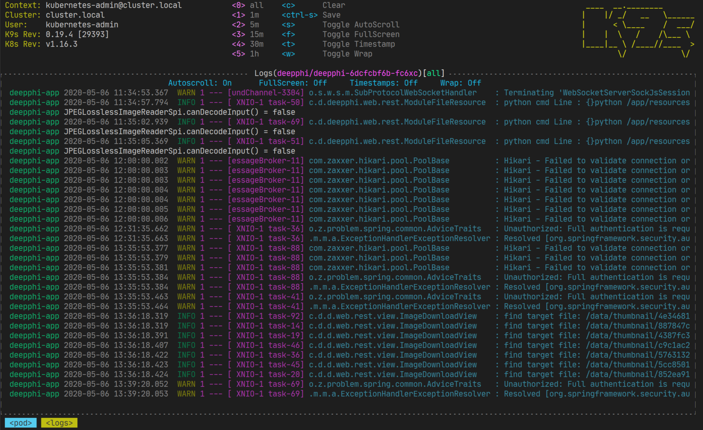

# Utils

## k9s

```sh
# 설치
wget https://github.com/derailed/k9s/releases/download/v0.19.4/k9s_Linux_x86_64.tar.gz
tar xvf k9s_Linux_x86_64.tar.gz
sudo mv k9s /usr/bin

# 실행
k9s

# 명령
:ns # 네임스페이스 조회

# 종료
Ctrl+C
```

| Action                                                        | Command                     | Comment                                                                |
|---------------------------------------------------------------|-----------------------------|------------------------------------------------------------------------|
| Show active keyboard mnemonics and help                       | ?                           |                                                                        |
| Show all available resource alias                             | ctrl-a                      |                                                                        |
| To bail out of K9s                                            | :q, ctrl-c                  |                                                                        |
| View a Kubernetes resource using singular/plural or shortname | :po⏎                        | accepts singular, plural, shortname or alias ie pod or pods            |
| View a Kubernetes resource in a given namespace               | :alias namespace⏎           |                                                                        |
| Filter out a resource view given a filter                     | /filter⏎                    |                                                                        |
| Filter resource view by labels                                | /-l label-selector⏎         |                                                                        |
| Fuzzy find a resource given a filter                          | /-f filter⏎                 |                                                                        |
| Bails out of view/command/filter mode                         | <esc>                       |                                                                        |
| Key mapping to describe, view, edit, view logs,...            | d,v, e, l,...               |                                                                        |
| To view and switch to another Kubernetes context              | :ctx⏎                       |                                                                        |
| To view and switch to another Kubernetes context              | :ctx context-name⏎          |                                                                        |
| To view and switch to another Kubernetes namespace            | :ns⏎                        |                                                                        |
| To view all saved resources                                   | :screendump or sd⏎          |                                                                        |
| To delete a resource (TAB and ENTER to confirm)               | ctrl-d                      |                                                                        |
| To kill a resource (no confirmation dialog!)                  | ctrl-k                      |                                                                        |
| Launch pulses view                                            | :pulses or pu⏎              |                                                                        |
| Launch XRay view                                              | :xray RESOURCE [NAMESPACE]⏎ | RESOURCE can be one of po, svc, dp, rs, sts, ds, NAMESPACE is optional |



